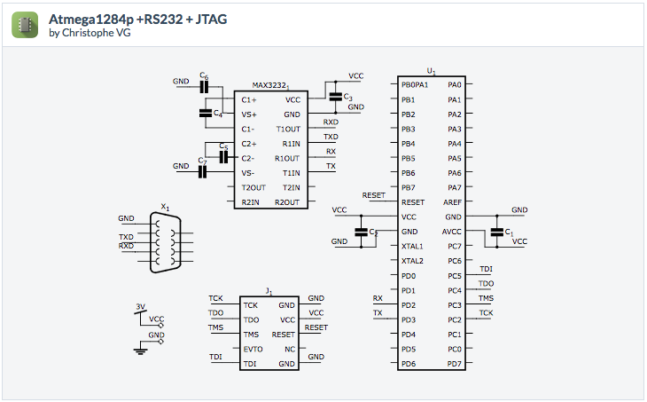
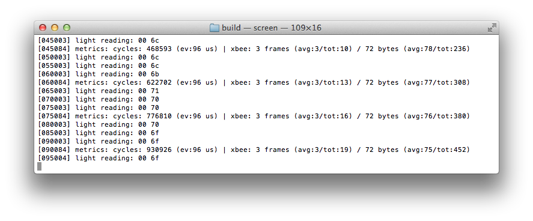

# TinyMoose

An experiment on integrating [Moose](https://github.com/christophevg/moose) and [TinyOS](https://github.com/tinyos/tinyos-main)  
Christophe VG <contact@christophe.vg>  
[https://github.com/christophevg/tinymoose](https://github.com/christophevg/tinymoose)

## Introduction

So far, I've been implementing my own hardware abstraction layer on top of the Atmel family of mcu's, called [Moose](https://github.com/christophevg/moose). With this experiment, I'm trying to run TinyOS on my own hardware, implementing what's missing using Moose, like the XBee networking support.

## Rationale

The reason for this unholy matrimony originates from another experiment, where I want to compare the optimizations of TinyOS to those of the Functional Code Fusion paradigm, developed for [foo-lang](https://github.com/christophevg/foo-lang). To do this, I want comparable versions of the software running on the same hardware. The initial comparison was against hand-written code, now I want to compare to NesC/TinyOS-based code, so I need to layer TinyOS on top of Moose, or vise versa, creating TinyMoose ;-)

## Getting started

TinyMoose, builds on TinyOS and Moose. Both projects are on GitHub, and are included in this repo as submodules. The top-level Makefile ensures that everything is initialized, updated and built as needed.

```bash
$ make
*** initializing and updating submodules...
*** building NesC...
```

If building NesC fails, check `.nesc.build.log`, which contains all output.

Running the command a second time, doesn't do any harm, `make` will tell you all is up to date ;-)

```bash
$ make
make: `all' is up to date.
```

## TinyOS Support for ATMEGA1284p

The main TinyOS codebase doesn't contain support for the ATMEGA1284p, which is the MCU used in the hardware of this experiment. Luckily, Martin Cerveny wrote platform support for the Atmel AVR Raven, which runs on the same MCU. It can still be found in the TinyOS 2.x contrib repository, which is mirrored at [https://github.com/tyll/tinyos-2.x-contrib](https://github.com/tyll/tinyos-2.x-contrib).

Following the porting instructions, found in the [README](https://github.com/tinyos/tinyos-main/blob/master/support/make/README.md) of the [support/make](https://github.com/tinyos/tinyos-main/blob/master/support/make/) folder of the TinyOS main repository, I've ported this experimental platform implementation to the new (3.x) build infrastructure.

The code of this port is located in the [tinyos-contrib](tinyos-contrib) folder of this project, separated from the tinyos-main repository. It can be added to the main repository by copying the files from the contrib folder to the main folder, as explained in the [README](tinyos-contrib/README) in the contrib folder. This is only needed if we want to extract the `nesc1` command to only generate the `app.c` source code, as explained in the next section.

## Hardware

I like to keep things minimal, at least at first, and this also applies to the first set of examples of TinyMoose: an ATMEGA1284p, programmable through JTAG and an RS232 interface through a MAX(3)232 for interacting with our newfound minimalistic computer.

<p align="center">
<a href="http://123d.circuits.io/circuits/785257"></a>
</p>

## Examples

Every example builds from a single `make` command. It uses `nesc1` to generate the single C file that contains everything. Next, it uses Moose's build infrastructure to build it.

The output of `nesc1` is caught in `.nesc.generation.log`, hidden by default, but shown if an error occurs.

To construct the command line instructions for using `nesc1`, one can first call the normal build instruction `make raven` to initiate the normal TinyOS (3.x) build process. A `Makefile.tos` is provided in the first example to illustrate how to perform this operation:

```bash
$ make -f Makefile.tos raven
[INFO] compiling HelloAppC to a raven binary
nescc -o build/raven/main.exe   -Os -gcc=avr-gcc -Wnesc-all -fnesc-include=tos -fnesc-scheduler=TinySchedulerC,TinySchedulerC.TaskBasic,TaskBasic,TaskBasic,runTask,postTask -fnesc-cfile=build/raven/app.c -fnesc-separator=__ -I../../tinyos-main/tos/platforms/raven -I../../tinyos-main/tos/platforms/raven/chips/rf230 -I../../tinyos-main/tos/chips/rf230 -I../../tinyos-main/tos/chips/atm1284 -I../../tinyos-main/tos/chips/atm1284/adc -I../../tinyos-main/tos/chips/atm1284/pins -I../../tinyos-main/tos/chips/atm1284/i2c -I../../tinyos-main/tos/chips/atm1284/timer -I../../tinyos-main/tos/chips/atm128 -I../../tinyos-main/tos/chips/atm128/adc -I../../tinyos-main/tos/chips/atm128/pins -I../../tinyos-main/tos/chips/atm128/spi -I../../tinyos-main/tos/chips/atm128/i2c -I../../tinyos-main/tos/chips/atm128/timer -I../../tinyos-main/tos/lib/timer -I../../tinyos-main/tos/lib/serial -I../../tinyos-main/tos/lib/power -I../../tinyos-main/tos/lib/diagmsg -I../../tinyos-main/tos/lib/rfxlink/layers -I../../tinyos-main/tos/lib/rfxlink/util -mmcu=atmega1284p -fnesc-target=avr -fnesc-no-debug -DATM128_I2C_EXTERNAL_PULLDOWN=TRUE -DPLATFORM_RAVEN -Wall -Wshadow --param max-inline-insns-single=100000 -Wno-unused-but-set-variable -Wno-enum-compare -I../../tinyos-main/tos/system -I../../tinyos-main/tos/types -I../../tinyos-main/tos/interfaces -DIDENT_APPNAME=\"HelloAppC\" -DIDENT_USERNAME=\"xtof\" -DIDENT_HOSTNAME=\"redrover.local\" -DIDENT_USERHASH=0xabb4daa6L -DIDENT_TIMESTAMP=0x5548a2c7L -DIDENT_UIDHASH=0xbca85efdL -fnesc-dump=wiring -fnesc-dump='interfaces(!abstract())' -fnesc-dump='referenced(interfacedefs, components)' -fnesc-dumpfile=build/raven/wiring-check.xml HelloAppC.nc -lm  
HelloC.nc:2:26: error: moose/serial.h: No such file or directory
In file included from HelloAppC.nc:6:
In component `HelloC':
HelloC.nc: In function `Boot.booted':
HelloC.nc:10: implicit declaration of function `avr_init'
HelloC.nc:11: implicit declaration of function `serial_init'
``` 

The process fails due to Moose functionality not being available, but that's okay, since we want to reuse the Moose build infrastructure afterwards.

We can take the command starting with `nescc` (line 3) and issue it with an additional `-v` switch to get verbose output, **and** an additional `-I../../` switch to provide the references to the Moose header files:

```bash
$ nescc -o build/raven/main.exe -Os -gcc=avr-gcc -Wnesc-all -fnesc-include=tos -fnesc-scheduler=TinySchedulerC,TinySchedulerC.TaskBasic,TaskBasic,TaskBasic,runTask,postTask -fnesc-cfile=build/raven/app.c -fnesc-separator=__ -I../../ -I../../tinyos-main/tos/platforms/raven -I../../tinyos-main/tos/platforms/raven/chips/rf230 -I../../tinyos-main/tos/chips/rf230 -I../../tinyos-main/tos/chips/atm1284 -I../../tinyos-main/tos/chips/atm1284/adc -I../../tinyos-main/tos/chips/atm1284/pins -I../../tinyos-main/tos/chips/atm1284/i2c -I../../tinyos-main/tos/chips/atm1284/timer -I../../tinyos-main/tos/chips/atm128 -I../../tinyos-main/tos/chips/atm128/adc -I../../tinyos-main/tos/chips/atm128/pins -I../../tinyos-main/tos/chips/atm128/spi -I../../tinyos-main/tos/chips/atm128/i2c -I../../tinyos-main/tos/chips/atm128/timer -I../../tinyos-main/tos/lib/timer -I../../tinyos-main/tos/lib/serial -I../../tinyos-main/tos/lib/power -I../../tinyos-main/tos/lib/diagmsg -I../../tinyos-main/tos/lib/rfxlink/layers -I../../tinyos-main/tos/lib/rfxlink/util -mmcu=atmega1284p -fnesc-target=avr -fnesc-no-debug -DATM128_I2C_EXTERNAL_PULLDOWN=TRUE -DPLATFORM_RAVEN -Wall -Wshadow --param max-inline-insns-single=100000 -Wno-unused-but-set-variable -Wno-enum-compare -I../../tinyos-main/tos/system -I../../tinyos-main/tos/types -I../../tinyos-main/tos/interfaces -DIDENT_APPNAME=\"HelloAppC\" -DIDENT_USERNAME=\"xtof\" -DIDENT_HOSTNAME=\"redrover.local\" -DIDENT_USERHASH=0xabb4daa6L -DIDENT_TIMESTAMP=0x5548a2c7L -DIDENT_UIDHASH=0xbca85efdL -fnesc-dump=wiring -fnesc-dump='interfaces(!abstract())' -fnesc-dump='referenced(interfacedefs, components)' -fnesc-dumpfile=build/raven/wiring-check.xml -v HelloAppC.nc -lm  
nescc: 1.3.6
...
nesc1 -U__BLOCKS__ -fnesc-include=deputy_nodeputy -fnesc-gcc=avr-gcc -mmcu=atmega1284p -DATM128_I2C_EXTERNAL_PULLDOWN=TRUE -DPLATFORM_RAVEN -DIDENT_APPNAME="HelloAppC" -DIDENT_USERNAME="xtof" -DIDENT_HOSTNAME="redrover.local" -DIDENT_USERHASH=0xabb4daa6L -DIDENT_TIMESTAMP=0x5548a2c7L -DIDENT_UIDHASH=0xbca85efdL -DNESC=136 -I/usr/local/lib/ncc -I../../ -I../../tinyos-main/tos/platforms/raven -I../../tinyos-main/tos/platforms/raven/chips/rf230 -I../../tinyos-main/tos/chips/rf230 -I../../tinyos-main/tos/chips/atm1284 -I../../tinyos-main/tos/chips/atm1284/adc -I../../tinyos-main/tos/chips/atm1284/pins -I../../tinyos-main/tos/chips/atm1284/i2c -I../../tinyos-main/tos/chips/atm1284/timer -I../../tinyos-main/tos/chips/atm128 -I../../tinyos-main/tos/chips/atm128/adc -I../../tinyos-main/tos/chips/atm128/pins -I../../tinyos-main/tos/chips/atm128/spi -I../../tinyos-main/tos/chips/atm128/i2c -I../../tinyos-main/tos/chips/atm128/timer -I../../tinyos-main/tos/lib/timer -I../../tinyos-main/tos/lib/serial -I../../tinyos-main/tos/lib/power -I../../tinyos-main/tos/lib/diagmsg -I../../tinyos-main/tos/lib/rfxlink/layers -I../../tinyos-main/tos/lib/rfxlink/util -I../../tinyos-main/tos/system -I../../tinyos-main/tos/types -I../../tinyos-main/tos/interfaces -Wall -Wshadow -Wno-unused-but-set-variable -Wno-enum-compare -v -fnesc-tmpcfile=/var/folders/98/xs_z9zpx49lghsx5gpggfnsw0000gn/T//ccZ8UC1d.c -fnesc-include=nesc_nx -Wnesc-all -fnesc-include=tos -fnesc-scheduler=TinySchedulerC,TinySchedulerC.TaskBasic,TaskBasic,TaskBasic,runTask,postTask -fnesc-separator=__ -fnesc-target=avr -fnesc-no-debug -fnesc-dump=wiring -fnesc-dump=interfaces(!abstract()) -fnesc-dump=referenced(interfacedefs, components) -fnesc-dumpfile=build/raven/wiring-check.xml HelloAppC.nc -o build/raven/app.c
```

We're only interested in the generated `nesc1` command line, which produces `build/raven/app.c`. A cleaned up version, with pointers into the contrib folder is provided in the default `Makefile` in the example folder.

### Hello TinyMoose

The hello world example of TinyMoose, consists of one single `HelloC` component and accompanying `HelloAppC` application:

```c
#include <stdio.h>

#include "moose/avr.h"
#include "moose/serial.h"

module HelloC{
  uses interface Boot;
}

implementation{
  event void Boot.booted() {
    avr_init();
    serial_init();
    printf("Hello World\n");
  }
}
```

Functions `avr_init` and `serial_init` are calls into the Moose codebase and initialize the MCU and the serial support. Amongst others, the output of `printf` calls is rerouted to the serial connection.

```c
configuration HelloAppC {}

implementation{ 
	components HelloC, MainC;

	HelloC.Boot -> MainC.Boot;
}
```

The `HelloAppC` application  wires the `MainC.Boot` interface to `HelloC.Boot` which will receive the `Boot.booted` events and handles them, simply printing out `Hello World`.

Building the example requires a simple `make` command:

```bash
$ cd src/hello/
$ make
*** constructing build/main.c for Hello example...
*** adding Makefile to build Hello example...
*** building Hello example...
--- compiling main.c
../../tinyos-contrib/tos/chips/atm1284/atm128hardware.h:91:1: warning: function declaration isn’t a prototype [-Wstrict-prototypes]
../../tinyos-contrib/tos/chips/atm1284/atm128hardware.h:95:1: warning: function declaration isn’t a prototype [-Wstrict-prototypes]
../../tinyos-contrib/tos/chips/atm1284/atm128hardware.h:95:23: warning: function declaration isn’t a prototype [-Wstrict-prototypes]
../../tinyos-contrib/tos/chips/atm1284/atm128hardware.h:91:23: warning: function declaration isn’t a prototype [-Wstrict-prototypes]
--- linking main.elf
--- creating HEX image
--- creating EEPROM
--- creating extended listing file
--- creating symbol table

main.elf  :
section         size      addr
.data             26   8388864
.text           3832         0
.bss              10   8388890
.stab            540         0
.stabstr         189         0
.comment          17         0
.debug_info     1938         0
.debug_abbrev   1833         0
.debug_line       29         0
.debug_str       662         0
Total           9076
```

We can now move forward into the `build` folder:

```bash
$ cd build/
redrover:build xtof$ ls -l
total 392
-rw-r--r--  1 xtof  staff     52 May  5 13:26 Makefile
-rw-r--r--  1 xtof  staff  33022 May  5 13:26 main.c
-rw-r--r--  1 xtof  staff     13 May  5 13:26 main.eep
-rwxr-xr-x  1 xtof  staff  13625 May  5 13:26 main.elf
-rw-r--r--  1 xtof  staff  10875 May  5 13:26 main.hex
-rw-r--r--  1 xtof  staff  67095 May  5 13:26 main.lss
-rw-r--r--  1 xtof  staff  11416 May  5 13:26 main.lst
-rw-r--r--  1 xtof  staff  33240 May  5 13:26 main.map
-rw-r--r--  1 xtof  staff   2412 May  5 13:26 main.o
-rw-r--r--  1 xtof  staff   3029 May  5 13:26 main.sym
```

Using the Moose-based `Makefile` a `main.hex` is already compiled, which we now can use to program the hardware.

_Mind that you'll have to fiddle a bit with some environment variables to get the right port for avrdude. Take a look at the [Makefile](https://github.com/christophevg/moose/blob/master/Makefile) in the Moose folder._

```bash
$ make program
avrdude -p atmega1284p -P usb:5a:cb -c jtag2 -U flash:w:main.hex 
...
avrdude: 3858 bytes of flash written
...
avrdude done.  Thank you.
```

If you now hook up the hardware to a serial to USB adapter and issue a screen to monitor it, on boot you will see the output of the `printf` call:

<p align="center">

</p>

### Greetings

Oh, well, so far for the minimalistic approach. Let's add the network. The hardware I actually talked about before are the motes I designed for my master's thesis: the XT0F-004. It extends the previous very basic setup with an XBee ZigBee module (and a few LEDs, reset switch and a light sensor):

<p align="center">

</p>

<p align="center">
<a href="http://123d.circuits.io/circuits/786196"></a>
</p>

(yeah, I know, the reset switch and light sensor aren't included in the diagram)

So it's time to implement some interfaces. For example the `Send` and `Receive` interfaces, provided by TinyOS:

```c
interface Send {
  // Send a packet with a data payload of len.
  command error_t send(message_t* msg, uint8_t len);
  // Cancel a requested transmission.
  command error_t cancel(message_t* msg);
  // Signal in response to an accepted send request.
  event void sendDone(message_t* msg, error_t error);
  // Return the maximum payload length that this communication layer can provide.
  command uint8_t maxPayloadLength();
  // Return a pointer to a protocol's payload region in a packet which has at least a certain length.
  command void* getPayload(message_t* msg, uint8_t len);
}
```

```c
interface Receive {
  // Receive a packet buffer, returning a buffer for the signaling
  // component to use for the next reception.
  event message_t* receive(message_t* msg, void* payload, uint8_t len);
}
```

Moose has the following functions to deal with the XBee radio:

```c
// send an XBee formatted frame/packet
void xbee_send(xbee_tx_t *frame);
// register a handler for received packets
void xbee_on_receive(xbee_rx_handler_t handler);
// request to process (optionally aka non blocking) received packets
void xbee_receive(void);
```

TinyOS has an extended `message_t` structure in place, nicely described in `tep111` and defined in `message.h`. It boils down to the following definition:

```c
#ifndef TOSH_DATA_LENGTH
#define TOSH_DATA_LENGTH 28
#endif

typedef nx_struct message_t {
  nx_uint8_t header[sizeof(message_header_t)];
  nx_uint8_t data[TOSH_DATA_LENGTH];
  nx_uint8_t footer[sizeof(message_footer_t)];
  nx_uint8_t metadata[sizeof(message_metadata_t)];
} message_t;
```

`message_header_t`, `message_footer_t` and `message_metadata_t` SHOULD be opaque types, which means we SHOULD provide a component with an interface that enables retrieval of all included fields.

#### xbee_receive()

Moose is based on the concept of an [event loop](http://en.wikipedia.org/wiki/Event_loop), which has to contain a call to `xbee_receive`. This function will check if incoming messages are available and dispatch them to the handler(s) that have been registered using `xbee_on_receive`.

Since TinyOS doesn't provide us access to this, we will have to implement this repetitive task differently, using a task scheduled using a timer (see also `tep06`):

```c
#include "Timer.h"
#include "moose/xbee.h"

module ReceiveTaskC {
  uses interface Boot;
  uses interface Timer<TMilli> as Timer0;
}

implementation {
  event void Boot.booted() {
    call Timer0.startPeriodic(50);
  }

  task void receive() {
    xbee_receive();
  }

  event void Timer0.fired() {
    post receive();
  }
}
```

But that's only part of the solution...

#### Introducing the XBee Module

Let's extend the `ReceiveTaskC` module and add our own `SimpleReceive` and `SimpleSend` interfaces, creating the `XBee` module.

```c
module XBeeC {
  provides interface SimpleSend;
  provides interface SimpleReceive;

  uses interface Boot;
  uses interface Timer<TMilli> as Timer0;
}
```

`SimpleSend` defines

```c
#include <TinyError.h>

interface SimpleSend {
  event void ready(void);
  command error_t send(uint8_t *bytes, uint8_t size);
}
```

and `SimpleReceive` defines

```c
interface SimpleReceive {
  event void received(uint8_t *bytes, uint8_t size);
}
```

`XBeeC` implements `SimpleSend.send` and signals `SimpleReceive.received`:

```c
module XBeeC {
  provides interface SimpleSend;
  provides interface SimpleReceive;

  uses interface Boot;
  uses interface Timer<TMilli> as Timer0;
}

implementation {
  ...
  command error_t SimpleSend.send(uint8_t *bytes, const uint8_t size) {
    ...
    xbee_send(&frame);
    
    return SUCCESS;
  }
  ...
  void handle_frame(xbee_rx_t *frame) {
    signal SimpleReceive.received(frame->data, frame->size);
  }
  ...
  event void Boot.booted() {
    ...
    xbee_on_receive(handle_frame);
    ...
    signal SimpleSend.ready();
  }
```

The only thing left to do is create a top-level App configuration, `GreetAppC`:

```c
configuration GreetAppC {}

implementation{ 
  components MooseC, XBeeC, GreeterC, MainC;
  components new TimerMilliC() as Timer0;

  MooseC.Boot  -> MainC.Boot;

  XBeeC.Boot   -> MainC.Boot;
  XBeeC.Timer0 -> Timer0;

  GreeterC.SimpleSend    -> XBeeC.SimpleSend;
  GreeterC.SimpleReceive -> XBeeC.SimpleReceive;
}
```

To run it, we flash the example to the device using `make`, which spawns a `screen` showing the output of the app on the serial connection.

<p align="center">

</p>

Next we hook up another XBee in coordinator mode using an explorer board and use the example python script `coordinate.py` to dump the received frames and send back a greeting to the child...

<p align="center">

</p>

<p align="center">

</p>

### Frames and SimpleXBee

The `SimpleSend` and `SimpleReceive` interfaces are nice for initial examples, but soon we will need access to all aspects of the communication. Exposing these interfaces on `XBeeC`, and add extended interfaces is possible, but we can also extract the functionality from our current implementation, and add a `SimpleXBeeC` module that operates as a proxy in between, hiding the underlying XBee architecture:

<p align="center">

</p>

The `FrameSend` interface comes pretty close to the standard `Send` interface, as does the `FrameReceive` to `Send`. Although it would be possible to extend the implementation even further to compatibility with and use of these interfaces, there is little use at this point.

### Extending IO

So far, we've _simply_ sent all traffic to the coordinator of the network, which in many WSNs makes sense, but sometimes, we want more control over the destination of our frames. So, let's _extend_ the _simple_ XBee implementation and give allow to specify the destination and the origin of messages. We also include broadcast support now:

```c
#include <TinyError.h>

interface ExtendedSend {
  event void ready(void);

  command error_t broadcast(uint8_t *bytes, uint8_t size);
  command error_t broadcast_str(const char *string);

  command error_t send(uint64_t address, uint16_t nw_address,
                       uint8_t *bytes, uint8_t size);
  command error_t send_str(uint64_t address, uint16_t nw_address,
                           const char *string);
}
```

```c
interface ExtendedReceive {
  event void received(uint64_t address, uint16_t nw_address,
                      uint8_t *bytes, uint8_t size);
}
```

After upgrading and rewiring our `GreeterC`...

```c
configuration ExtendedIOAppC {}

implementation{ 
  components MooseC, XBeeC, ExtendedXBeeC, GreeterC, MainC;
  components new TimerMilliC() as Timer0;

  MooseC.Boot  -> MainC.Boot;

  XBeeC.Boot   -> MainC.Boot;
  XBeeC.Timer0 -> Timer0;

  ExtendedXBeeC.FrameSend    -> XBeeC.FrameSend;
  ExtendedXBeeC.FrameReceive -> XBeeC.FrameReceive;
  ExtendedXBeeC.XBeeFrame    -> XBeeC.XBeeFrame;

  GreeterC.ExtendedSend       -> ExtendedXBeeC.ExtendedSend;
  GreeterC.ExtendedReceive    -> ExtendedXBeeC.ExtendedReceive;
}
```

... we get the following result with information about the network addresses in use:

<p align="center">

</p>

<p align="center">

</p>

**NOTE**: It's a convention for XBee routers to have a parent address `ff fe`. This doesn't correspond to the _actual_ network address of the coordinator in this case, which is `00 00`.

### Mesh Support

The extended information is about what you can get out of the XBee API. But XBee modules create a meshed network, mostly a tree-structure with each child propagating its frame to its parent, thus routing the messages through the network.

XBee also doesn't provide access to raw frame information for frames sent between other nodes (aka promiscuous mode). And XBee's default broadcasting support is flawed - as soon as you send many packets, they get dropped due to a buffer overflow.

To alleviate this in software, we could layer a component the solves all these problems, by implementing all communication using unicast messages, sending all messages to both parent and children - to simulate the promiscuous behavior - and adding additional information about the origin , destination and the hop taken in the meshed network.

This example implements a mini-meshed network, consisting of three nodes - although the implementation could probably allow for larger networks:

<p align="center">

</p>

The end-node and the router each send out:

1. a message to the coordinator of the topology
2. a broadcast message

The end-device knows about the router, because it's its parent, the router doesn't know about the end-device ... until it receives a frame coming from it.

**NOTE**: To force the XBee modules to take on each role, we set the `NJ` network join time of the coordinator to e.g. 40 seconds. After that, the end-node can't join the coordinator and will be forced to join through the router.

Both `MeshSend` and `MeshReceive` only deal with the 16-bit network addresses. Because the `VirtualMeshC` component only send unicast frames to its parent, it knows the 64-bit address to use. The component also packs additional routing information in the frame: `from`, `to` and `hop` contain the addresses of the original sender, the eventual recipient and the hop that was taken to deliver this frame.

```c
#include <TinyError.h>

interface MeshSend {
  event void ready(void);

  event void transmitted(uint16_t from, uint16_t to, uint16_t hop,
                         uint8_t *bytes, uint8_t size);

  command error_t broadcast(uint8_t *bytes, uint8_t size);
  command error_t broadcast_str(const char *string);

  command error_t send(uint16_t to, uint8_t *bytes, uint8_t size);
  command error_t send_str(uint16_t to, const char *string);
}
```

```c
interface MeshReceive {
  event void received(uint16_t source,
                      uint16_t from, uint16_t to, uint16_t hop,
                      uint8_t *bytes, uint8_t size);
}
```

We can now track the messages as they are flowing through the virtual meshed network: The end-node (with address `ca db`) starts up and waits for its parent to notice its `join` broadcasts. Its parent is the router (with address `a9 47`), that is also waiting for messages to arrive, coming from the end-node. As soon as the router receives such a (broadcasted `join`) message, it starts sending out its own messages, one unicast to the coordinator and one broadcast to all.

The messages of the router reach the coordinator, but also the end-node, because the virtual mesh implementation sends a copy of each message destined for the coordinator, also to the end-node, to simulate the promiscuous behaviour. The end-node therefore receives both messages, originating from the router, destined for the coordinator (unicast address `00 00` and broadcast address `ff fe`).

<p align="center">

</p>

The receiving of the messages triggers the end-node to start sending its own messages, which are passed on to its parent, the router. Both messages are forwarded by the router, and again also copied to the end-node, who receives the "echo" of its own messages being forwarded.

<p align="center">

</p>

The coordinator receives all four messages and gives an overview of the messages and their virtual routing information:

<p align="center">

</p>

### Time for an Intermezzo

Some of the algorithms I want to implement to compare, require time. Moose provides `clock_get_millis()` which returns the current amount of milliseconds that have passed since initialisation of the clock using `clock_init()`. TinyOS provides the `Timer` interface, which allows use to perform periodic executions using `startPeriodic(<interval>)`, which signals `event Timer.fired()`.

To make sure that the timers operate in comparable ways, I implemented a simple clock example:

```c
module ClockC {
	uses interface Boot;
  uses interface Timer<TMilli> as ClockTimer;
}

implementation{
	event void Boot.booted() {
    avr_init();
    serial_init();
    clock_init();
    call ClockTimer.startPeriodic(1000L * 250);   // magico !
    printf("now = 0   ");
  }
  
  time_t  max    = 9999;
  uint8_t length = 4;

  #define BACK_SPACE 8

  task void tick() {
    int i;
    time_t now = clock_get_millis();
    for(i=0;i<length;i++) { printf("%c", BACK_SPACE); }
    printf("%lu", now);
    if(now > max) {
      length++;
      max = max * 10 + 9;
    }
  }

  event void ClockTimer.fired() {
    post tick();
  }
}
```

There is a magic constant `250` in there which was needed to get the same `1000` milliseconds interval returned by `clock_get_millis()`. Maybe I should say millisecond-like ticks, because when timed, there is a difference with a real clock. But as this is merely a linear modification in time and results are processed relatively, this is not an issue.

The result is a simple milliseconds clock:

<p align="center">

</p>

### The base application

With (almost) everything in place, we can start implementing the application and the algorithms I want to compare. We start with a component for the base application: reading a light sensor value and reporting it to the coordinator, through the (virtually) meshed network.

The implementation boils down to...

```c
  event void MeshSend.ready() {
    avr_adc_init();                 // initialize the ADC for normal readings
    clock_init();
    call LightReadingTimer.startPeriodic(LIGHTREADING_INTERVAL * 250);
    _log("Light reading started...\n");
  }
  
  task void measure_and_send(void) {
    uint16_t reading;               // the 16-bit reading from the ADC
    uint8_t  values[2];             // the bytes containing the reading in bytes

    // read light sensor
    reading = avr_adc_read(LIGHT_SENSOR_PIN);
    values[0] = (reading >> 8);
    values[1] = reading;
  
    _log("light reading: %02x %02x\n", values[0], values[1]);

    // and send it to the coordinator through the mesh
    call MeshSend.send(DESTINATION, values, 2);
  }
  
  event void LightReadingTimer.fired() { post measure_and_send();  }
```

And the result looks like...

<p align="center">

</p>

At the coordinator we see the readings from the end-node (network address `9f aa`) reoccur, with the readings from the router (network address `a9 47`) also shown.

<p align="center">

</p>

Yes, it was pretty dark in my room at that time ;-)

### Two Hearts Beating

We're going to add two algorithms that can detect aberrations in the operation of the nodes. The first is a Heartbeat: each node broadcasts a frame at a known interval (in this case every 3 seconds), which is of course received by the other node. This node keeps track of these heartbeats and checks whether the interval is respected. If not, it will mark the node os suspicious, or at least not-trustworthy. Validation of this information isn't performed at the same time as the heartbeats are detected (or not), but at another interval that leaves some room for small, typically network problems.

The frame that is broadcasted consists of 25 bytes:

<table width="100%">
<tr><th colspan="3">payload bytes</th></tr>
<tr><th width="15%">0</th><th width="30%">1 - 4</th><th width="55%">5 - 24</th></tr>
<tr><td>sequence</td><td>timestamp</td><td>sha1(sequence,timestamp)</td></tr>
</table>

The sequence number is a `byte` containing an increasing numeric value. The timestamp is an `unsigned long` (4 bytes) containing the clock value of the sending node. The remaining 20 bytes contain a [SHA1](http://en.wikipedia.org/wiki/SHA-1) hash of the sequence and the timestamp. This allows the receiver to verify the integrity of the data.

Let's see it in action...

<p align="center">

</p>

When a node receives the first heartbeat of another node, it creates a record for this node to track it. It monitors the sequence number, when it last saw the node's heartbeat, how many incidents have been recorded and if it still trusts this node.

I've kept the router running until the end-node reported three heartbeats. At that moment I unplugged the router. Two things can be seen from the screenshot: the low-level network stack produces `transmission failed` messages and the heartbeat algorithm reports three times that the expected heartbeat wasn't observed, after which it marks the node as untrusted.

<p align="center">

</p>

At the coordinator we see that few frames made it, because I unplugged the router ;-) And yes, I opened up some of the shades, boosting the light intensity ;-)

**NOTE**: Given the output, I get the impression that TinyOS's way of dealing with periodic execution and `tasks` (see also [more info on its execution model](http://tinyos.stanford.edu/tinyos-wiki/index.php/Modules_and_the_TinyOS_Execution_Model:_Tasks)) makes the execution of the algorithms less predictable. When the end-node starts all of its functionality, many things are happening at the same time, so much that it even processes three heartbeats of the router before it can even send one of its own. To be investigated.

### Reputation

The second algorithm is one that keeps a reputation score on other nodes. Thanks to the promiscuous support in the virtual meshed network implementation, a node can check whether another node actually forwards messages it received. If not, something fishy is going on and we lower our trust in that node. The actual implementation uses a Beta-distribution, represented by parameters alpha and beta. For more details, see the paper _Reputation-based framework for high integrity sensor networks_ by Ganeriwal et al. from 2008.

Besides the processing of all messages - to verify correct forwarding - the algorithm also exchanges  reputation information with other nodes in the network. This second-hand information is also taken into account. Such a reputation-exchange message consists of 10 bytes:

<table width="100%">
<tr><th colspan="3">payload bytes</th></tr>
<tr><th width="20%">0 - 1</th><th width="40%">2 - 5</th><th width="40%">5 - 9</th></tr>
<tr><td>nw address</td><td>alpha param (float)</td><td>beta param (float)</td></tr>
</table>

The network address is the two bytes address of the node we're exchanging information about. The alpha and beta parameters, each a 4 byte `float`, define the beta-distribution used to determine the trustworthiness of that node.

In action, we see the different aspects of the algorithm operation...

<p align="center">

</p>

Every 5 seconds, a node validates known nodes. In this case there is only one, the parent-router. The computation of alpha and beta parameters is based on the amount of messages that weren't forwarded versus the amount of messages expected to be forwarded. Given these parameters, the algorithm computes a level of trust, which starts of at 0.50 - the algorithm doesn't know anything about the node and its reputation is neutral.

With each message that is correctly forwarded, the trust level increases. After 3 successful forwards, the trust level is at 0.80, and I (again) unplugged the router. With each validation, the trust level decreases until it goes below 0.25, at which point the node is marked as untrusted.

**NOTE**: Yes, there is a bug in there somewhere :-) It seems some tracked message isn't removed correctly from the tracked list, causing more late messages to be taken into account than possible. Still, this doesn't harm the overall idea. Maybe I'll look into it later ;-)

At the coordinator side we see...

<p align="center">

</p>

... a few light readings from both nodes and one broadcasted reputation message from the end-device. The sharing interval is set at 7.5 seconds, but since the router was unplugged after three successful forwards, the other broadcasts never made it to the coordinator. We can still see them in the log of the end-node, who tracks his reputation messages of size 10.

### All together now ... Detection

Combining all algorithms and the light sensing application itself, simply requires wiring alls components together. This is really where TinyOS shines:

```c
configuration DetectionAppC {}

implementation{ 
  components MooseC, XBeeC, VirtualMeshC,
             HeartbeatingC, ReputationC,
             LightReadingC,
             MainC;

  components new TimerMilliC() as NetworkTimer;

  components new TimerMilliC() as HeartbeatTimer;
  components new TimerMilliC() as ProcessingTimer;

  components new TimerMilliC() as ValidationTimer;
  components new TimerMilliC() as SharingTimer;

  components new TimerMilliC() as LightReadingTimer;

  MooseC.Boot                     -> MainC.Boot;

  XBeeC.Boot                      -> MainC.Boot;
  XBeeC.Timer0                    -> NetworkTimer;

  VirtualMeshC.FrameSend          -> XBeeC.FrameSend;
  VirtualMeshC.FrameReceive       -> XBeeC.FrameReceive;
  VirtualMeshC.XBeeFrame          -> XBeeC.XBeeFrame;

  HeartbeatingC.HeartbeatTimer    -> HeartbeatTimer;
  HeartbeatingC.ProcessingTimer   -> ProcessingTimer;

  HeartbeatingC.MeshSend          -> VirtualMeshC.MeshSend;
  HeartbeatingC.MeshReceive       -> VirtualMeshC.MeshReceive;
  
  ReputationC.ValidationTimer     -> ValidationTimer;
  ReputationC.SharingTimer        -> SharingTimer;

  ReputationC.MeshSend            -> VirtualMeshC.MeshSend;
  ReputationC.MeshReceive         -> VirtualMeshC.MeshReceive;

  LightReadingC.LightReadingTimer -> LightReadingTimer;

  LightReadingC.MeshSend          -> VirtualMeshC.MeshSend;
  LightReadingC.MeshReceive       -> VirtualMeshC.MeshReceive;
}
```

Now, I want to compare the impact of the algorithms. To do this I want to compare the number of messages that have been sent, the number of bytes that have been sent and ... the duration of the `event loop`.

Defining the event loop in the case of TinyOS, is not that straight forward. But if we take a look at the generated `.c` file, we might find a place that corresponds to it. We start at the `main()` function:

```c
int main(void ) {
  __nesc_atomic_t __nesc_atomic = __nesc_atomic_start();
  * (volatile uint8_t *)(0x34 + 0x20) = 0;
  __asm volatile ("in __tmp_reg__, __SREG__""\n\t""cli""\n\t""sts %0, %1""\n\t""sts %0, __zero_reg__""\n\t""out __SREG__,__tmp_reg__""\n\t" :  : "M"((uint16_t )& * (volatile uint8_t *)0x60), "r"((uint8_t )((1 << 4) | (1 << 3))) : "r0");
  RealMainP__Scheduler__init();
  RealMainP__PlatformInit__init();
  while (RealMainP__Scheduler__runNextTask()) ;
  RealMainP__SoftwareInit__init();
  while (RealMainP__Scheduler__runNextTask()) ;
  __nesc_atomic_end(__nesc_atomic);
  __nesc_enable_interrupt();
  RealMainP__Boot__booted();
  RealMainP__Scheduler__taskLoop();
  return -1;
}
```

In fact the line we're looking for is the one-but-last: `RealMainP__Scheduler__taskLoop()`:

```c
inline static void RealMainP__Scheduler__taskLoop(void) {
  SchedulerBasicP__Scheduler__taskLoop();
}
```

Okay, another redirection to `SchedulerBasicP__Scheduler__taskLoop()`:

```c
static inline void SchedulerBasicP__Scheduler__taskLoop(void) {
  for(;;) {
    uint8_t nextTask;
    __nesc_atomic_t __nesc_atomic = __nesc_atomic_start();
    while ((nextTask = SchedulerBasicP__popTask()) == SchedulerBasicP__NO_TASK) {
      SchedulerBasicP__McuSleep__sleep();
    }
    __nesc_atomic_end(__nesc_atomic);
    SchedulerBasicP__TaskBasic__runTask(nextTask);
  }
}
```

Here we find the real event loop, or `task loop` if you like. This endless `for(;;)` loop keeps iterating, looking for the next task and running it. All of our algorithms are (multiple) tasks that need to be run. Here we want to increase a variable, called `cycles`. But we need to ensure that the true meaning of the event loop span is honoured, not only the outer `for(;;)` loop defines an iteration of the event loop, but also the inner `while()` defines an iteration, one where there is no task at hand.

But first, let's add one more component to report on all of these parameters:

```c
  #define REPORTING_INTERVAL 15000L

  event void Boot.booted() {
    clock_init();
    call ReportingTimer.startPeriodic(REPORTING_INTERVAL * 250);
  }
  
  task void report(void) {
    static unsigned long total_frames  = 0,
                         total_bytes   = 0,
                         samples       = 0;
    time_t now;
    xbee_metrics_t metrics;

    now           = clock_get_millis();
    metrics       = xbee_reset_counters();
    total_frames += metrics.frames;
    total_bytes  += metrics.bytes;
    samples++;

    _log("metrics: cycles: %lu (ev:%u us) | xbee: %d frames (avg:%u/tot:%lu) / %i bytes (avg:%u/tot:%lu)\n",
         cycles, (unsigned int)((now * 1000.0) / cycles),
         metrics.frames, (unsigned int)(total_frames / samples), total_frames,
         metrics.bytes,  (unsigned int)(total_bytes  / samples), total_bytes);
    
  }
  
  event void ReportingTimer.fired() { post report();  }
```

Adding the `cycles++` instructions is done after a succesfull generation/compilation cycle. I've added a patch file that automatically will be applied. After 90 seconds the statistics look like this...

```bash
$ make
...
main.elf  :
section          size      addr
.data            1094   8388864
.text           17582         0
...
```

<p align="center">

</p>

Comparing it to the other configurations requires regeneration and recompilation of a different wiring. I've included all other configurations and each of them can ben invoked from the same detection example folder:

```bash
$ make -f Makefile.light
...
main.elf  :
section          size      addr
.data             534   8388864
.text           11094         0
...
```

<p align="center">

</p>

```bash
$ make -f Makefile.heartbeat
...
main.elf  :
section          size      addr
.data             806   8388864
.text           15392         0
...
```

<p align="center">

</p>

```bash
$ make -f Makefile.reputation
...
main.elf  :
section          size      addr
.data             822   8388864
.text           13484         0
...
```

<p align="center">

</p>

### Results Summary

The following tables summarises all results from the 4 experiments shown above:

<table width="100%">
<tr><th></th><th>light</th><th colspan="2">heartbeat</th><th colspan="2">reputation</th><th colspan="2">both</th></tr>
<tr align="right"><th>size (bytes)</th><td>11628</td><td>16198</td><td>139%</td><td>14306</td><td>123%</td><td>18676</td><td>161%</td></tr>
<tr align="right"><th>frames&nbsp;sent</th><td>19</td><td>52</td><td>274%</td><td>35</td><td>184%</td><td>64</td><td>337%</td></tr>
<tr align="right"><th>bytes&nbsp;sent</th><td>452</td><td>1922</td><td>425%</td><td>916</td><td>203%</td><td>2306</td><td>510%</td></tr>
<tr align="right"><th>event&nbsp;loop&nbsp;(&mu;s)</th><td>95</td><td>103</td><td>108%</td><td>101</td><td>106%</td><td>116</td><td>122%</td></tr>
</table>

### Puzzled...

Ok, so now I have all data, let's see how this compares to my earlier manual and generated solutions. The following table gives an overview of the timings of the event loop. To determine the average duration of one event-loop iteration, every event loop iteration a counter is incremented. After 15 seconds have passed, this counter is used to determine the average time of one event loop.

This way, I've computed the time for a completely manual case, a case where the code was generated and used a framework and now the result of nesC. The tabel starts with the base case: a simple light sensing application, next with additional heartbeat, with reputation and with both. In each case the `+` column shows what the additional algorithm _seems_ to add. The `theory` column computes the theoretical duration, and its correseponding `+` column shows the additional overhead of the actual time computed for both algorithms, also expressed as a relative value.

<table>
<tr><th colspan="11">Event Loop, average, in &mu;s</th></tr>
<tr><th></th><th>light</th><th>hb</th><th>+</th><th>rep</th><th>+</th><th>both</th><th>+</th><th>theory</th><th>+</th><th>%</th></tr>
<tr align="right"><th>manual</th><td>48</td><td>94</td><td>46</td><td>88</td><td>40</td><td>149</td><td>101</td><td>134</td><td>15</td><td>11%</td></tr>
<tr align="right"><th>generated</th><td>48</td><td>121</td><td>73</td><td>121</td><td>73</td><td>138</td><td>90</td><td>194</td><td>-56</td><td>-29%</td></tr>
<tr align="right"><th>nesc</th><td>95</td><td>103</td><td>8</td><td>101</td><td>6</td><td>116</td><td>21</td><td>109</td><td>7</td><td>6%</td></tr>
</table>

Some initial observations:

* nesC's approach adds about 50&mu;s to the base application, which I believe to be due to the framework in general. This includes e.g. the generic approach to periodic timers - which is about the only thing that changed porting the manual example to nesC.
* When adding the heartbeat algorithm, three observations can be made:
  * In the manual case adding the hearbeat, the event loop doubles on average.
  * In the generated case it increases even more. Here again generic framework code kicks in.
  * In case of nesC, the additional cost is merely 8&mu;s.

Until I got the nesC results, it never struck me but, there is something _strange_ with the additional cost of the heartbeat implementation in the manual (maybe also the generated) case. The nesC implementation is a minimal port of the manual code to nesC. The only thing that really got changed was the iterative execution of the broadcasting of heartbeats and the evaluation of known nodes.

What initially was written as...

```c
void heartbeat_step(void) {
  // intervals markers
  static time_t next_heartbeat  = 0;
  static time_t next_processing = 0;
  if(next_heartbeat == 0) {
    next_heartbeat = clock_get_millis();
    next_processing = clock_get_millis() + PROCESSING_INTERVAL;
  }

  time_t now = clock_get_millis();
  
  // send a heartbeat
  if( now >= next_heartbeat ) {
    beat();
    next_heartbeat += HEARTBEAT_INTERVAL;
  }

  now = clock_get_millis(); // refresh time, might bring next step closer ;-)
  
  // do background processing
  if( now >= next_processing ) {
    process();
    next_processing += PROCESSING_INTERVAL;
  }
}
```

...was turned into...

```c
  event void MeshSend.ready() {
    me = call MeshSend.get_own_nw_address();
    clock_init();
    call HeartbeatTimer.startPeriodic(HEARTBEAT_INTERVAL * 250);
    call ProcessingTimer.startPeriodic(PROCESSING_INTERVAL * 250);
  }
  ...
  event void HeartbeatTimer.fired()  { post beat();  }
  event void ProcessingTimer.fired() { post process(); }
```

So except for...

* two variables, `next_heartbeat` and `next_processing`, containing the next time when the next beat or a processing should happen
* two times fetching the current time (`clock_get_millis()` simply returns a `ticks` counter variable)
* two comparisons of these values

...the actual execution seems identical. And still...

Given that heartbeats are sent out every 3 seconds and processing is done every 5 seconds, a very big majority of the event loop iterations will be not executing `beat` and `process`. The few executions will thus be averaged over a large number of _idle_ loops.

In the case of nesC, an event loop for the light application with heartbeat checking takes about 100&mu;s, which means that it gets executed roughly 10.000 times per second, meaning that the time to sense the light is averaged over 50.000 iterations, as does the processing of heartbeats and the sending of heartbeats over 30.000 iterations.

The theoretical execution time of the heartbeat algorithm can be roughly estimated: In one second, the algorithm takes 10.000 x 8&mu;s or 80ms. In that same second 1/3 t\_beat and 1/5 t\_process are consumed, or 1/3 t\_beat + 1/5 t\_process = 80ms. This means that the theoretical execution time of _the_ heartbeat algorithm would lie somewhere between 240ms and 400ms.

Looking at the manual case, this would be even almost 6 times higher? For exactly the same algorithm/code, with the exceptions listed above. Which would mean that these exceptions take up about 5 times the time of the entire algorithm?

I'm puzzled. Time to upload some test programs to validate this.

### Comparing Event Loop Times

There are a few aspects that introduce uncertainty. Computing the average event-loop duration in both cases is different, reasonable, but different. So let's start with an algorithm of which we _known_ the exact execution time: `_delay_ms(200)`, which we execute with an interval of 2s.

So my first test component looks like...

```c
implementation{

  #define INTERVAL 2000L

	event void Boot.booted() {
    avr_init();
    serial_init();
    call LoopTimer.startPeriodic(INTERVAL * 250);
  }
  
  task void tick() { _delay_ms(200); }

  event void LoopTimer.fired() { post tick(); }
}
```

The reporting component is trimmed down a bit:

```c
implementation {

  #define REPORTING_INTERVAL 15000L

  event void Boot.booted() {
    clock_init();
    call ReportingTimer.startPeriodic(REPORTING_INTERVAL * 250);
  }
  
  task void report(void) {
    _log("metrics: cycles: %lu (ev:%u us)\n",
         cycles, (unsigned int)((clock_get_millis() * 1000.0) / cycles));
  }
  
  event void ReportingTimer.fired() { post report();  }
}
```

This gives the following result:

<p align="center">

</p>

Now, does that compute? The average event loop time is 496&mu;s. So that's about 2000 cycles per second. Every 2s, 200ms are added by the algorithm, or 100ms per second, which should compute to 50&mu;s. This seems again strange, because that would mean that about 450&mu;s would be due to the framework?!

### I Can Use Some Sleep ;-)

My initial idea to simply take into account the sleep-loop cycles, was straight up stupid. Let's revisit it and take another look at the event loop, after cleaning it up a bit more...

```c
static inline void taskLoop(void) {
  for(;;) {
    uint8_t nextTask;
    while((nextTask = popTask()) == NO_TASK) {
      cycles++;
      sleep();
    }
    runTask(nextTask);
    cycles++;
  }
}
```

The sleep loop shouldn't be treated like an event loop cycle, it should be removed, to allow comparison to the event loop of the other implementations. It should look like this:

```c
static inline void taskLoop(void) {
  for(;;) {
    uint8_t nextTask;
    if((nextTask = popTask()) != NO_TASK) {
      runTask(nextTask);
    }
    cycles++;
  }
}
```

Patching the loop experiment in this way, results in very different results:

<p align="center">

</p>

In 60 seconds we have 30 delays of 200ms, or 6000ms, and 11.817.954 cycles. So on average we'll delay 0.5&mu;s, which would mean the framework overhead is 4.5&mu;s. That should more like it.

_More to come soon..._
