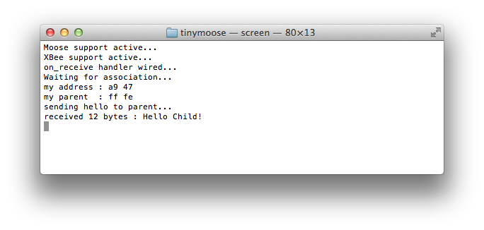

# TinyMoose

An experiment on integrating [Moose](https://github.com/christophevg/moose) and [TinyOS](https://github.com/tinyos/tinyos-main)  
Christophe VG <contact@christophe.vg>  
[https://github.com/christophevg/tinymoose](https://github.com/christophevg/tinymoose)

## Introduction

So far, I've been implementing my own hardware abstraction layer on top of the Atmel family of mcu's, called [Moose](https://github.com/christophevg/moose). With this experiment, I'm trying to run TinyOS on my own hardware, implementing what's missing using Moose, like the XBee networking support.

## Rationale

The reason for this unholy matrimony originates from another experiment, where I want to compare the optimizations of TinyOS to those of the Functional Code Fusion paradigm, developed for [foo-lang](https://github.com/christophevg/foo-lang). To do this, I want comparable versions of the software running on the same hardware. The initial comparison was against hand-written code, now I want to compare to NesC/TinyOS-based code, so I need to layer TinyOS on top of Moose, or vise versa, creating TinyMoose ;-)

## Getting started

TinyMoose, builds on TinyOS and Moose. Both projects are on GitHub, and are included in this repo as submodules. The top-level Makefile ensures that everything is initialized, updated and built as needed.

```bash
$ make
*** initializing and updating submodules...
*** building NesC...
```

If building NesC fails, check `.nesc.build.log`, which contains all output.

Running the command a second time, doesn't do any harm, `make` will tell you all is up to date ;-)

```bash
$ make
make: `all' is up to date.
```

## TinyOS Support for ATMEGA1284p

The main TinyOS codebase doesn't contain support for the ATMEGA1284p, which is the MCU used in the hardware of this experiment. Luckily, Martin Cerveny wrote platform support for the Atmel AVR Raven, which runs on the same MCU. It can still be found in the TinyOS 2.x contrib repository, which is mirrored at [https://github.com/tyll/tinyos-2.x-contrib](https://github.com/tyll/tinyos-2.x-contrib).

Following the porting instructions, found in the [README](https://github.com/tinyos/tinyos-main/blob/master/support/make/README.md) of the [support/make](https://github.com/tinyos/tinyos-main/blob/master/support/make/) folder of the TinyOS main repository, I've ported this experimental platform implementation to the new (3.x) build infrastructure.

The code of this port is located in the [tinyos-contrib](tinyos-contrib) folder of this project, separated from the tinyos-main repository. It can be added to the main repository by copying the files from the contrib folder to the main folder, as explained in the [README](tinyos-contrib/README) in the contrib folder. This is only needed if we want to extract the `nesc1` command to only generate the `app.c` source code, as explained in the next section.

## Hardware

I like to keep things minimal, at least at first, and this also applies to the first set of examples of TinyMoose: an ATMEGA1284p, programmable through JTAG and an RS232 interface through a MAX(3)232 for interacting with our newfound minimalistic computer.

<p align="center">
<a href="http://123d.circuits.io/circuits/785257"></a>
</p>

## Examples

Every example builds from a single `make` command. It uses `nesc1` to generate the single C file that contains everything. Next, it uses Moose's build infrastructure to build it.

The output of `nesc1` is caught in `.nesc.generation.log`, hidden by default, but shown if an error occurs.

To construct the command line instructions for using `nesc1`, one can first call the normal build instruction `make raven` to initiate the normal TinyOS (3.x) build process. A `Makefile.tos` is provided in the first example to illustrate how to perform this operation:

```bash
$ make -f Makefile.tos raven
[INFO] compiling HelloAppC to a raven binary
nescc -o build/raven/main.exe   -Os -gcc=avr-gcc -Wnesc-all -fnesc-include=tos -fnesc-scheduler=TinySchedulerC,TinySchedulerC.TaskBasic,TaskBasic,TaskBasic,runTask,postTask -fnesc-cfile=build/raven/app.c -fnesc-separator=__ -I../../tinyos-main/tos/platforms/raven -I../../tinyos-main/tos/platforms/raven/chips/rf230 -I../../tinyos-main/tos/chips/rf230 -I../../tinyos-main/tos/chips/atm1284 -I../../tinyos-main/tos/chips/atm1284/adc -I../../tinyos-main/tos/chips/atm1284/pins -I../../tinyos-main/tos/chips/atm1284/i2c -I../../tinyos-main/tos/chips/atm1284/timer -I../../tinyos-main/tos/chips/atm128 -I../../tinyos-main/tos/chips/atm128/adc -I../../tinyos-main/tos/chips/atm128/pins -I../../tinyos-main/tos/chips/atm128/spi -I../../tinyos-main/tos/chips/atm128/i2c -I../../tinyos-main/tos/chips/atm128/timer -I../../tinyos-main/tos/lib/timer -I../../tinyos-main/tos/lib/serial -I../../tinyos-main/tos/lib/power -I../../tinyos-main/tos/lib/diagmsg -I../../tinyos-main/tos/lib/rfxlink/layers -I../../tinyos-main/tos/lib/rfxlink/util -mmcu=atmega1284p -fnesc-target=avr -fnesc-no-debug -DATM128_I2C_EXTERNAL_PULLDOWN=TRUE -DPLATFORM_RAVEN -Wall -Wshadow --param max-inline-insns-single=100000 -Wno-unused-but-set-variable -Wno-enum-compare -I../../tinyos-main/tos/system -I../../tinyos-main/tos/types -I../../tinyos-main/tos/interfaces -DIDENT_APPNAME=\"HelloAppC\" -DIDENT_USERNAME=\"xtof\" -DIDENT_HOSTNAME=\"redrover.local\" -DIDENT_USERHASH=0xabb4daa6L -DIDENT_TIMESTAMP=0x5548a2c7L -DIDENT_UIDHASH=0xbca85efdL -fnesc-dump=wiring -fnesc-dump='interfaces(!abstract())' -fnesc-dump='referenced(interfacedefs, components)' -fnesc-dumpfile=build/raven/wiring-check.xml HelloAppC.nc -lm  
HelloC.nc:2:26: error: moose/serial.h: No such file or directory
In file included from HelloAppC.nc:6:
In component `HelloC':
HelloC.nc: In function `Boot.booted':
HelloC.nc:10: implicit declaration of function `avr_init'
HelloC.nc:11: implicit declaration of function `serial_init'
``` 

The process fails due to Moose functionality not being available, but that's okay, since we want to reuse the Moose build infrastructure afterwards.

We can take the command starting with `nescc` (line 3) and issue it with an additional `-v` switch to get verbose output, **and** an additional `-I../../` switch to provide the references to the Moose header files:

```bash
$ nescc -o build/raven/main.exe -Os -gcc=avr-gcc -Wnesc-all -fnesc-include=tos -fnesc-scheduler=TinySchedulerC,TinySchedulerC.TaskBasic,TaskBasic,TaskBasic,runTask,postTask -fnesc-cfile=build/raven/app.c -fnesc-separator=__ -I../../ -I../../tinyos-main/tos/platforms/raven -I../../tinyos-main/tos/platforms/raven/chips/rf230 -I../../tinyos-main/tos/chips/rf230 -I../../tinyos-main/tos/chips/atm1284 -I../../tinyos-main/tos/chips/atm1284/adc -I../../tinyos-main/tos/chips/atm1284/pins -I../../tinyos-main/tos/chips/atm1284/i2c -I../../tinyos-main/tos/chips/atm1284/timer -I../../tinyos-main/tos/chips/atm128 -I../../tinyos-main/tos/chips/atm128/adc -I../../tinyos-main/tos/chips/atm128/pins -I../../tinyos-main/tos/chips/atm128/spi -I../../tinyos-main/tos/chips/atm128/i2c -I../../tinyos-main/tos/chips/atm128/timer -I../../tinyos-main/tos/lib/timer -I../../tinyos-main/tos/lib/serial -I../../tinyos-main/tos/lib/power -I../../tinyos-main/tos/lib/diagmsg -I../../tinyos-main/tos/lib/rfxlink/layers -I../../tinyos-main/tos/lib/rfxlink/util -mmcu=atmega1284p -fnesc-target=avr -fnesc-no-debug -DATM128_I2C_EXTERNAL_PULLDOWN=TRUE -DPLATFORM_RAVEN -Wall -Wshadow --param max-inline-insns-single=100000 -Wno-unused-but-set-variable -Wno-enum-compare -I../../tinyos-main/tos/system -I../../tinyos-main/tos/types -I../../tinyos-main/tos/interfaces -DIDENT_APPNAME=\"HelloAppC\" -DIDENT_USERNAME=\"xtof\" -DIDENT_HOSTNAME=\"redrover.local\" -DIDENT_USERHASH=0xabb4daa6L -DIDENT_TIMESTAMP=0x5548a2c7L -DIDENT_UIDHASH=0xbca85efdL -fnesc-dump=wiring -fnesc-dump='interfaces(!abstract())' -fnesc-dump='referenced(interfacedefs, components)' -fnesc-dumpfile=build/raven/wiring-check.xml -v HelloAppC.nc -lm  
nescc: 1.3.6
...
nesc1 -U__BLOCKS__ -fnesc-include=deputy_nodeputy -fnesc-gcc=avr-gcc -mmcu=atmega1284p -DATM128_I2C_EXTERNAL_PULLDOWN=TRUE -DPLATFORM_RAVEN -DIDENT_APPNAME="HelloAppC" -DIDENT_USERNAME="xtof" -DIDENT_HOSTNAME="redrover.local" -DIDENT_USERHASH=0xabb4daa6L -DIDENT_TIMESTAMP=0x5548a2c7L -DIDENT_UIDHASH=0xbca85efdL -DNESC=136 -I/usr/local/lib/ncc -I../../ -I../../tinyos-main/tos/platforms/raven -I../../tinyos-main/tos/platforms/raven/chips/rf230 -I../../tinyos-main/tos/chips/rf230 -I../../tinyos-main/tos/chips/atm1284 -I../../tinyos-main/tos/chips/atm1284/adc -I../../tinyos-main/tos/chips/atm1284/pins -I../../tinyos-main/tos/chips/atm1284/i2c -I../../tinyos-main/tos/chips/atm1284/timer -I../../tinyos-main/tos/chips/atm128 -I../../tinyos-main/tos/chips/atm128/adc -I../../tinyos-main/tos/chips/atm128/pins -I../../tinyos-main/tos/chips/atm128/spi -I../../tinyos-main/tos/chips/atm128/i2c -I../../tinyos-main/tos/chips/atm128/timer -I../../tinyos-main/tos/lib/timer -I../../tinyos-main/tos/lib/serial -I../../tinyos-main/tos/lib/power -I../../tinyos-main/tos/lib/diagmsg -I../../tinyos-main/tos/lib/rfxlink/layers -I../../tinyos-main/tos/lib/rfxlink/util -I../../tinyos-main/tos/system -I../../tinyos-main/tos/types -I../../tinyos-main/tos/interfaces -Wall -Wshadow -Wno-unused-but-set-variable -Wno-enum-compare -v -fnesc-tmpcfile=/var/folders/98/xs_z9zpx49lghsx5gpggfnsw0000gn/T//ccZ8UC1d.c -fnesc-include=nesc_nx -Wnesc-all -fnesc-include=tos -fnesc-scheduler=TinySchedulerC,TinySchedulerC.TaskBasic,TaskBasic,TaskBasic,runTask,postTask -fnesc-separator=__ -fnesc-target=avr -fnesc-no-debug -fnesc-dump=wiring -fnesc-dump=interfaces(!abstract()) -fnesc-dump=referenced(interfacedefs, components) -fnesc-dumpfile=build/raven/wiring-check.xml HelloAppC.nc -o build/raven/app.c
```

We're only interested in the generated `nesc1` command line, which produces `build/raven/app.c`. A cleaned up version, with pointers into the contrib folder is provided in the default `Makefile` in the example folder.

### Hello TinyMoose

The hello world example of TinyMoose, consists of one single `HelloC` component and accompanying `HelloAppC` application:

```c
#include <stdio.h>

#include "moose/avr.h"
#include "moose/serial.h"

module HelloC{
  uses interface Boot;
}

implementation{
  event void Boot.booted() {
    avr_init();
    serial_init();
    printf("Hello World\n");
  }
}
```

Functions `avr_init` and `serial_init` are calls into the Moose codebase and initialize the MCU and the serial support. Amongst others, the output of `printf` calls is rerouted to the serial connection.

```c
configuration HelloAppC {}

implementation{ 
	components HelloC, MainC;

	HelloC.Boot -> MainC.Boot;
}
```

The `HelloAppC` application  wires the `MainC.Boot` interface to `HelloC.Boot` which will receive the `Boot.booted` events and handles them, simply printing out `Hello World`.

Building the example requires a simple `make` command:

```bash
$ cd src/hello/
$ make
*** constructing build/main.c for Hello example...
*** adding Makefile to build Hello example...
*** building Hello example...
--- compiling main.c
../../tinyos-contrib/tos/chips/atm1284/atm128hardware.h:91:1: warning: function declaration isn’t a prototype [-Wstrict-prototypes]
../../tinyos-contrib/tos/chips/atm1284/atm128hardware.h:95:1: warning: function declaration isn’t a prototype [-Wstrict-prototypes]
../../tinyos-contrib/tos/chips/atm1284/atm128hardware.h:95:23: warning: function declaration isn’t a prototype [-Wstrict-prototypes]
../../tinyos-contrib/tos/chips/atm1284/atm128hardware.h:91:23: warning: function declaration isn’t a prototype [-Wstrict-prototypes]
--- linking main.elf
--- creating HEX image
--- creating EEPROM
--- creating extended listing file
--- creating symbol table

main.elf  :
section         size      addr
.data             26   8388864
.text           3832         0
.bss              10   8388890
.stab            540         0
.stabstr         189         0
.comment          17         0
.debug_info     1938         0
.debug_abbrev   1833         0
.debug_line       29         0
.debug_str       662         0
Total           9076
```

We can now move forward into the `build` folder:

```bash
$ cd build/
redrover:build xtof$ ls -l
total 392
-rw-r--r--  1 xtof  staff     52 May  5 13:26 Makefile
-rw-r--r--  1 xtof  staff  33022 May  5 13:26 main.c
-rw-r--r--  1 xtof  staff     13 May  5 13:26 main.eep
-rwxr-xr-x  1 xtof  staff  13625 May  5 13:26 main.elf
-rw-r--r--  1 xtof  staff  10875 May  5 13:26 main.hex
-rw-r--r--  1 xtof  staff  67095 May  5 13:26 main.lss
-rw-r--r--  1 xtof  staff  11416 May  5 13:26 main.lst
-rw-r--r--  1 xtof  staff  33240 May  5 13:26 main.map
-rw-r--r--  1 xtof  staff   2412 May  5 13:26 main.o
-rw-r--r--  1 xtof  staff   3029 May  5 13:26 main.sym
```

Using the Moose-based `Makefile` a `main.hex` is already compiled, which we now can use to program the hardware.

_Mind that you'll have to fiddle a bit with some environment variables to get the right port for avrdude. Take a look at the [Makefile](https://github.com/christophevg/moose/blob/master/Makefile) in the Moose folder._

```bash
$ make program
avrdude -p atmega1284p -P usb:5a:cb -c jtag2 -U flash:w:main.hex 
...
avrdude: 3858 bytes of flash written
...
avrdude done.  Thank you.
```

If you now hook up the hardware to a serial to USB adapter and issue a screen to monitor it, on boot you will see the output of the `printf` call:

<p align="center">

</p>

### Greetings

Oh, well, so far for the minimalistic approach. Let's add the network. The hardware I actually talked about before are the motes I designed for my master's thesis: the XT0F-004. It extends the previous very basic setup with an XBee ZigBee module (and a few LEDs, reset switch and a light sensor:

<p align="center">

</p>

<p align="center">
<a href="http://123d.circuits.io/circuits/786196"></a>
</p>

(yeah, I know, the reset switch and light sensor aren't included in the diagram)

So it's time to implement some interfaces. For example the `Send` and `Receive` interfaces, provided by TinyOS:

```c
interface Send {
  // Send a packet with a data payload of len.
  command error_t send(message_t* msg, uint8_t len);
  // Cancel a requested transmission.
  command error_t cancel(message_t* msg);
  // Signal in response to an accepted send request.
  event void sendDone(message_t* msg, error_t error);
  // Return the maximum payload length that this communication layer can provide.
  command uint8_t maxPayloadLength();
  // Return a pointer to a protocol's payload region in a packet which has at least a certain length.
  command void* getPayload(message_t* msg, uint8_t len);
}
```

```c
interface Receive {
  // Receive a packet buffer, returning a buffer for the signaling
  // component to use for the next reception.
  event message_t* receive(message_t* msg, void* payload, uint8_t len);
}
```

Moose has the following functions to deal with the XBee radio:

```c
// send an XBee formatted frame/packet
void xbee_send(xbee_tx_t *frame);
// register a handler for received packets
void xbee_on_receive(xbee_rx_handler_t handler);
// request to process (optionally aka non blocking) received packets
void xbee_receive(void);
```

TinyOS has an extended `message_t` structure in place, nicely described in `tep111` and defined in `message.h`. It boils down to the following definition:

```c
#ifndef TOSH_DATA_LENGTH
#define TOSH_DATA_LENGTH 28
#endif

typedef nx_struct message_t {
  nx_uint8_t header[sizeof(message_header_t)];
  nx_uint8_t data[TOSH_DATA_LENGTH];
  nx_uint8_t footer[sizeof(message_footer_t)];
  nx_uint8_t metadata[sizeof(message_metadata_t)];
} message_t;
```

`message_header_t`, `message_footer_t` and `message_metadata_t` SHOULD be opaque types, which means we SHOULD provide a component with an interface that enables retrieval of all included fields.

#### xbee_receive()

Moose is based on the concept of an [event loop](http://en.wikipedia.org/wiki/Event_loop), which has to contain a call to `xbee_receive`. This function will check if incoming messages are available and dispatch them to the handler(s) that have been registered using `xbee_on_receive`.

Since TinyOS doesn't provide us access to this, we will have to implement this repetitive task differently, using a task scheduled using a timer (see also `tep06`):

```c
#include "Timer.h"
#include "moose/xbee.h"

module ReceiveTaskC {
  uses interface Boot;
  uses interface Timer<TMilli> as Timer0;
}

implementation {
  event void Boot.booted() {
    call Timer0.startPeriodic(50);
  }

  task void receive() {
    xbee_receive();
  }

  event void Timer0.fired() {
    post receive();
  }
}
```

But that's only part of the solution...

#### Introducing the XBee Module

Let's extend the `ReceiveTaskC` module and add our own `SimpleReceive` and `SimpleSend` interfaces, creating the `XBee` module.

```c
module XBeeC {
  provides interface SimpleSend;
  provides interface SimpleReceive;

  uses interface Boot;
  uses interface Timer<TMilli> as Timer0;
}
```

`SimpleSend` defines

```c
#include <TinyError.h>

interface SimpleSend {
  event void ready(void);
  command error_t send(uint8_t *bytes, uint8_t size);
}
```

and `SimpleReceive` defines

```c
interface SimpleReceive {
  event void received(uint8_t *bytes, uint8_t size);
}
```

`XBeeC` implements `SimpleSend.send` and signals `SimpleReceive.received`:

```c
module XBeeC {
  provides interface SimpleSend;
  provides interface SimpleReceive;

  uses interface Boot;
  uses interface Timer<TMilli> as Timer0;
}

implementation {
  ...
  command error_t SimpleSend.send(uint8_t *bytes, const uint8_t size) {
    ...
    xbee_send(&frame);
    
    return SUCCESS;
  }
  ...
  void handle_frame(xbee_rx_t *frame) {
    signal SimpleReceive.received(frame->data, frame->size);
  }
  ...
  event void Boot.booted() {
    ...
    xbee_on_receive(handle_frame);
    ...
    signal SimpleSend.ready();
  }
```

The only thing left to do is create a top-level App configuration, `GreetAppC`:

```c
configuration GreetAppC {}

implementation{ 
  components MooseC, XBeeC, GreeterC, MainC;
  components new TimerMilliC() as Timer0;

  MooseC.Boot  -> MainC.Boot;

  XBeeC.Boot   -> MainC.Boot;
  XBeeC.Timer0 -> Timer0;

  GreeterC.SimpleSend    -> XBeeC.SimpleSend;
  GreeterC.SimpleReceive -> XBeeC.SimpleReceive;
}
```

To run it, we flash the example to the device using `make`, which spawns a `screen` showing the output of the app on the serial connection.

<p align="center">

</p>

Next we hook up another XBee in coordinator mode using an explorer board and use the example python script `coordinate.py` to dump the received frames and send back a greeting to the child...

<p align="center">

</p>

<p align="center">

</p>

### Frames and SimpleXBee

The `SimpleSend` and `SimpleReceive` interfaces are nice for initial examples, but soon we will need access to all aspects of the communication. Exposing these interfaces on `XBeeC`, and add extended interfaces is possible, but we can also extract the functionality from our current implementation, and add a `SimpleXBeeC` module that operates as a proxy in between, hiding the underlying XBee architecture:

<p align="center">

</p>

The `FrameSend` interface comes pretty close to the standard `Send` interface, as does the `FrameReceive` to `Send`. Although it would be possible to extend the implementation even further to compatibility with and use of these interfaces, there is little use at this point.

### Extending IO

So far, we've _simply_ sent all traffic to the coordinator of the network, which in many WSNs makes sense, but sometimes, we want more control over the destination of our frames. So, let's _extend_ the _simple_ XBee implementation and give allow to specify the destination and the origin of messages. We also include broadcast support now:

```c
#include <TinyError.h>

interface ExtendedSend {
  event void ready(void);

  command error_t broadcast(uint8_t *bytes, uint8_t size);
  command error_t broadcast_str(const char *string);

  command error_t send(uint64_t address, uint16_t nw_address,
                       uint8_t *bytes, uint8_t size);
  command error_t send_str(uint64_t address, uint16_t nw_address,
                           const char *string);
}
```

```c
interface ExtendedReceive {
  event void received(uint64_t address, uint16_t nw_address,
                      uint8_t *bytes, uint8_t size);
}
```

After upgrading and rewiring our `GreeterC`...

```c
configuration ExtendedIOAppC {}

implementation{ 
  components MooseC, XBeeC, ExtendedXBeeC, GreeterC, MainC;
  components new TimerMilliC() as Timer0;

  MooseC.Boot  -> MainC.Boot;

  XBeeC.Boot   -> MainC.Boot;
  XBeeC.Timer0 -> Timer0;

  ExtendedXBeeC.FrameSend    -> XBeeC.FrameSend;
  ExtendedXBeeC.FrameReceive -> XBeeC.FrameReceive;
  ExtendedXBeeC.XBeeFrame    -> XBeeC.XBeeFrame;

  GreeterC.ExtendedSend       -> ExtendedXBeeC.ExtendedSend;
  GreeterC.ExtendedReceive    -> ExtendedXBeeC.ExtendedReceive;
}
```

... we get the following result with information about the network addresses in use:

<p align="center">

</p>

<p align="center">

</p>

**NOTE**: It's a convention for XBee routers to have a parent address `ff fe`. This doesn't correspond to the _actual_ network address of the coordinator in this case, which is `00 00`.

### Mesh Support

The extended information is about what you can get out of the XBee API. But XBee modules create a meshed network, mostly a tree-structure with each child propagating its frame to its parent, thus routing the messages through the network.

XBee also doesn't provide access to raw frame information for frames sent between other nodes (aka promiscuous mode). And XBee's default broadcasting support is flawed - as soon as you send many packets, they get dropped due to a buffer overflow.

To alleviate this in software, we could layer a component the solves all these problems, by implementing all communication using unicast messages, sending all messages to both parent and children - to simulate the promiscuous behavior - and adding additional information about the origin , destination and the hop taken in the meshed network.

This example implements a mini-meshed network, consisting of three nodes - although the implementation could probably allow for larger networks:

<p align="center">

</p>

The end-node and the router each send out:

1. a message to the coordinator of the topology
2. a broadcast message

The end-device knows about the router, because it's its parent, the router doesn't know about the end-device ... until it receives a frame coming from it.

**NOTE**: To force the XBee modules to take on each role, we set the `NJ` network join time of the coordinator to e.g. 40 seconds. After that, the end-node can't join the coordinator and will be forced to join through the router.

Both `MeshSend` and `MeshReceive` only deal with the 16-bit network addresses. Because the `VirtualMeshC` component only send unicast frames to its parent, it knows the 64-bit address to use. The component also packs additional routing information in the frame: `from`, `to` and `hop` contain the addresses of the original sender, the eventual recipient and the hop that was taken to deliver this frame.

```c
#include <TinyError.h>

interface MeshSend {
  event void ready(void);

  event void transmitted(uint16_t from, uint16_t to, uint16_t hop,
                         uint8_t *bytes, uint8_t size);

  command error_t broadcast(uint8_t *bytes, uint8_t size);
  command error_t broadcast_str(const char *string);

  command error_t send(uint16_t to, uint8_t *bytes, uint8_t size);
  command error_t send_str(uint16_t to, const char *string);
}
```

```c
interface MeshReceive {
  event void received(uint16_t source,
                      uint16_t from, uint16_t to, uint16_t hop,
                      uint8_t *bytes, uint8_t size);
}
```

We can now track the messages as they are flowing through the virtual meshed network: The end-node (with address `ca db`) starts up and waits for its parent to notice its `join` broadcasts. Its parent is the router (with address `a9 47`), that is also waiting for messages to arrive, coming from the end-node. As soon as the router receives such a (broadcasted `join`) message, it starts sending out its own messages, one unicast to the coordinator and one broadcast to all.

The messages of the router reach the coordinator, but also the end-node, because the virtual mesh implementation sends a copy of each message destined for the coordinator, also to the end-node, to simulate the promiscuous behaviour. The end-node therefore receives both messages, originating from the router, destined for the coordinator (unicast address `00 00` and broadcast address `ff fe`).

<p align="center">

</p>

The receiving of the messages triggers the end-node to start sending its own messages, which are passed on to its parent, the router. Both messages are forwarded by the router, and again also copied to the end-node, who receives the "echo" of its own messages being forwarded.

<p align="center">

</p>

The coordinator receives all four messages and gives an overview of the messages and their virtual routing information:

<p align="center">

</p>


_More to come soon..._
